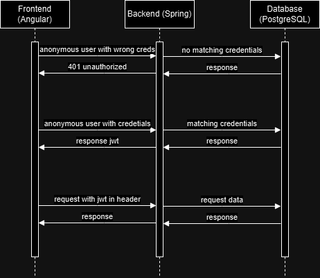
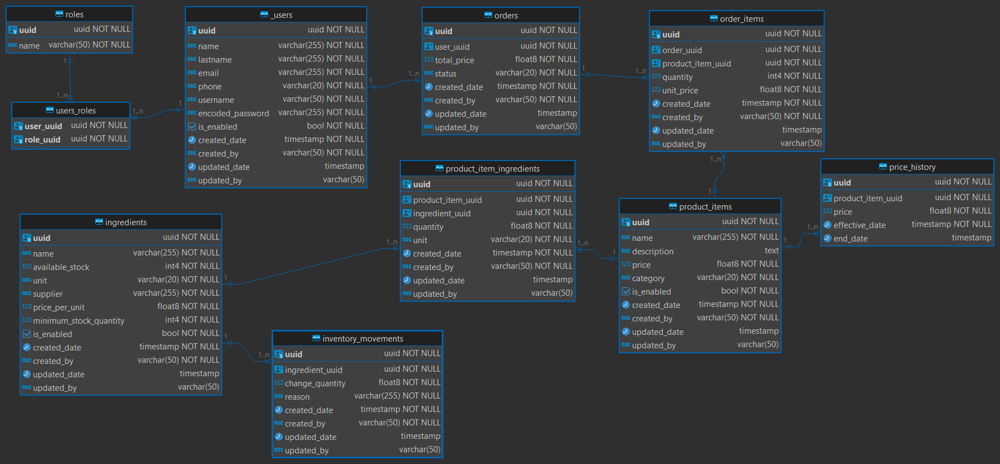

# GastroManager
The GastroManager is a restaurant management application that is designed to streamline and enhance the operational efficiency of restaurants. This web-based solution provides restaurant owners and staff with tools to manage inventory, place orders, and optimize kitchen operations seamlessly.

# Project Title:
Restaurant Management System GastroManager

# Problem Statement:
Managing restaurant operations like inventory control, menu updates, and sales reporting can be inefficient when handled manually. Inaccuracies in stock levels, difficulty tracking ingredient usage, and a lack of insightful reporting can lead to resource wastage and operational delays. This project aims to provide an integrated system to streamline these tasks, enhancing overall restaurant efficiency.

# Brief Overview of the Application’s Functionality:
The Restaurant Management System is a web-based application designed to manage restaurant operations such as inventory tracking, menu management, orders placing and sales reporting. It simplifies daily operations by automatically updating inventory levels when orders are placed and providing detailed performance reports. The system will also ensure secure access through role-based permissions with JWT authentication.

# Technology Stack:
- **Frontend**: Angular for a dynamic, user-friendly interface.
- **Backend**: Java and Spring Boot for server-side logic and REST API development.
- **Database**: PostgreSQL for efficient and scalable data management.
- **Security**: JWT (JSON Web Token) for user authentication and role-based access control.
- **Containerization**: Docker for creating consistent environments for development and deployment.
- **Version Control**: Git and GitHub for managing source code and version control.

# Features to Be Implemented:

- **Inventory Management:**
  - Automatically deduct ingredient quantities from inventory when a menu item is ordered.
  - Set alerts for low stock levels and generate inventory usage reports (not in first MVP).

- **Menu Management:**
  - Add, update, and remove menu items, including specifying ingredients, categories and prices.
  - Ensure that menu item availability is updated based on current inventory levels (not in first MVP).

- **Orders Management:**
  - Create order for the clients including the menu items and its quantities for each order, and automatically substract the quantities for each ingredient from the inventory.

- **Sales and Reporting:**
  - Generate sales reports based on daily, weekly, or monthly data.
  - Provide insights into popular dishes and track ingredient costs for better decision-making (not in first MVP).

- **User Role Management:**
  - Implement different user roles (e.g., owner, admin, waitress, etc).
  - Secure the application using JWT for authentication, with role-based permissions to control access to features.

# User stories

The user stories (opened and closed) for this project can be found here: [GitHub User Stories](https://github.com/CarlosBrrs/GastroManager/issues?q=)

# Design & API Contract

## Entities
Entities with Auditing properties should have:
- uuid UUID String PK
- createdBy String not null not updatable
- createdDate Instant (UTC) not null not updatable
- updatedBy String
- updatedDate Instant (UTC)

### User Auditable
- name String
- lastname String
- email String unique
- phone String unique
- username String unique
- encodedPassword String
- roles Set<Role>
- isEnabled boolean not null default true

### Role
- uuid UUID unique not null
- name String

### Order Auditable
- user User not null (who place the order)
- totalPrice double not null
- items Set<OrderItem> not null (The items that the order contains)
- status Status not null (PENDING default, PREPARING, COMPLETED, CANCELLED)

### OrderItem weak from Order
- productItem ProductItem not null
- quantity int not null
- price double not null (price of the item at the moment of the order, useful for discounts or auditing purposes)


### Ingredient Auditable
- name String not null
- availableStock int not null
- unit Unit not null
- pricePerUnit double not null
- minimumStockQuantity int not null

### ProductItem Auditable
- name String not null
- description String
- price double not null (price of the dish or product in the menu)
- category Category not null (BREAKFAST, LUNCH, DINNER, DRINK, SIDE_DISH, FRIED_FOOD, FAST_FOOD)
- ingredients Set<ProductItemIngredient>

### ProductItemIngredient Auditable (to map how much of an ingredient a productItem uses) weak
- productItem ProductItem
- ingredient Ingredient
- quantity double  
- unit Unit

### InventoryMovement weak
- uuid UUID String PK
- ingredient Ingredient not null 
- changeQuantity double not null (+ or -. The quantity that has to be added or substracted from availableStock)
- reason String not null
- timestamp Instant (UTC) not null
- createdBy String not null

### PriceHistory weak
- uuid UUID PK
- productItem ProductItem not null
- price double not null
- effectiveDate Instant (UTC) not null
- endDate Instant (UTC)

## Relationships
- User
  - A user can have multiple roles 1:N
  - A user can place multiple orders 1:N

- Role
  - A rol can be assigned to multiple users 1:N

- Order
  - An order can be placed by one user 1:1
  - An order can contain one or multiple orderitems 1:N

- OrderItem
  - An order item is part of one order 1:1
  - An order item refers to one product item 1:1

- ProductItem
  - A product item can be part of multiple order items 1:N
  - A product item can have multiple product item ingredients 1:N
  - A product item can have multiple price histories 1:N

- ProductItemIngredient
  - A product item ingredient is part of one product item 1:1
  - A product item ingredient is associated with one ingredient 1:1

- Ingredient
  - An ingredient can be associated with multiple product item ingredients 1:N
  - An ingredient can have multiple inventory movements 1:N

- InventoryMovement
  - An inventory movement can be associated to one ingredient 1:1

- PriceHistory
  - A price hisory is associated with one product item 1:1

## High level architecture



## Database schema



## API Contracts and roles

The requests to the API are going to be a json object, and the schema will depend on each request, which is defined below.

The response of the API is in the same schema whether it is a successfull response or not: 
```json
{
  "timestamp": string,
  "flag":boolean,
  "message": string,
  "data": Object
}
```
The roles in the system are going to be:
- ROLE_SUPERUSER
- ROLE_OWNER
- ROLE_MANAGER
- ROLE_WAITER
- ROLE_CHEF
- ROLE_KITCHEN_STAFF
- ROLE_CASHIER

Role 'ROLE_SUPERUSER' will have access to all the resources in the system and it is reserved for the owner of the application

### Users management
METHOD | ENDPOINT | DESCRIPTION | ALLOWED ROLES
--- | --- | --- | --- 
POST | /api/v1/users | Create a new user | ROLE_OWNER  ROLE_MANAGER
GET | /api/v1/users | Retrieve all users | ROLE_OWNER  ROLE_MANAGER
GET | /api/v1/users/{uuid} | Retrieve a user by UUID | ROLE_OWNER  ROLE_MANAGER
PUT | /api/v1/users/{uuid} | Update an existing user by UUID | ROLE_OWNER  ROLE_MANAGER
PATCH | /api/v1/users/{uuid}/deactivate | Deactivate an active user by UUID | ROLE_OWNER
PATCH | /api/v1/users/{uuid}/activate | Activate a deactivated user by UUID | ROLE_OWNER
PUT | /api/v1/users/{userUuid}/roles | Assign roles to a user by its UUID | ROLE_OWNER
DELETE | /api/v1/users/{userUuid}/roles/{roleUuid} | Delete a role by UUID from a user by UUID | ROLE_OWNER

### Roles management
METHOD | ENDPOINT | DESCRIPTION | ALLOWED ROLES
--- | --- | --- | --- 
GET | /api/v1/roles | Retrieve all roles | ROLE_OWNER  ROLE_MANAGER
GET | /api/v1/roles/{uuid} | Retrieve a role by UUID | ROLE_OWNER  ROLE_MANAGER

### Ingredients management
METHOD | ENDPOINT | DESCRIPTION | ALLOWED ROLES
--- | --- | --- | --- 
POST | /api/v1/ingredients | Create a new ingredient | ROLE_OWNER  ROLE_MANAGER  ROLE_CHEF
GET | /api/v1/ingredients | Retrieve all ingredients | ALL ROLES
GET | /api/v1/ingredients/{ingredientUuid} | Retrieve an ingredient by UUID | ALL ROLES
PUT | /api/v1/ingredients/{ingredientUuid} | Update an existing ingredient by UUID | ROLE_OWNER  ROLE_MANAGER  ROLE_CHEF
PATCH | /api/v1/ingredients/{ingredientUuid}/deactivate | Deactivate an ingredient by UUID (not in first MVP) | ROLE_OWNER  ROLE_MANAGER  ROLE_CHEF
PATCH | /api/v1/ingredients/{ingredientUuid}/activate | Activate a deactivated ingredient by UUID (not in first MVP) | ROLE_OWNER  ROLE_MANAGER  ROLE_CHEF
DELETE | /api/v1/ingredients/{ingredientUuid} |	Delete an ingredient by UUID (optional - not in first MVP) | ROLE_OWNER  ROLE_MANAGER

### Product item management
METHOD | ENDPOINT	| DESCRIPTION	| ALLOWED ROLES
--- | --- | --- | --- 
POST | /api/v1/product-items | Create a new product item | ROLE_OWNER  ROLE_MANAGER
GET | /api/v1/product-items | Retrieve all product items | ALL ROLES
GET | /api/v1/product-items/{productItemUuid} | Retrieve a product item by UUID | ALL ROLES
PUT | /api/v1/product-items/{productItemUuid} | Update an existing product item by UUID | ROLE_OWNER  ROLE_MANAGER
PATCH | /api/v1/product-items/{productItemUuid}/deactivate | Deactivate a product item by UUID | ROLE_OWNER  ROLE_MANAGER
PATCH | /api/v1/product-items/{productItemUuid}/activate | Activate a deactivated product item by UUID | ROLE_OWNER  ROLE_MANAGER
DELETE | /api/v1/product-items/{productItemUuid} | Delete a product item by UUID (only if already deactivated) | ROLE_OWNER  ROLE_MANAGER

#### GET /api/v1/ingredients (View Inventory)
- **Description**: Retrieve a list of ingredients in the inventory
- **Endpoint**: /api/v1/ingredients
- **Method**: GET
- **Request Body**: None
- **Response Body (200 OK):**
```json
{
  "timestamp": "2024-10-08T10:00:00Z",
  "flag": true,
  "message": "Inventory retrieved successfully",
  "data": [
    {
      "uuid": "123e4567-e89b-12d3-a456-426614174000",
      "name": "Tomato",
      "stockLevel": 1000,
      "unit": "g",
      "pricePerUnit": 0.5,
      "lastUpdated": "2024-10-08T10:00:00Z"
    },
    {
      "uuid": "123e4567-e89b-12d3-a456-426614174001",
      "name": "Olive Oil",
      "stockLevel": 500,
      "unit": "mL",
      "pricePerUnit": 1.0,
      "lastUpdated": "2024-10-08T09:30:00Z"
    }
  ]
}

```

#### GET /api/v1/ingredients/{ingredientId} (View Ingredient by ID)
- **Description**: Retrieve a specific ingredient's details by ID.
- **Endpoint**: /api/v1/ingredients/{ingredientId}
- **Method**: GET
- **Request Body**: None
- **Response Body (200 OK):**
```json
{
  "timestamp": "2024-10-08T10:00:00Z",
  "flag": true,
  "message": "Ingredient retrieved successfully",
  "data": {
    "uuid": "123e4567-e89b-12d3-a456-426614174000",
    "name": "Tomato",
    "stockLevel": 1000,
    "unit": "g",
    "pricePerUnit": 0.5,
    "lastUpdated": "2024-10-08T10:00:00Z"
  }
}

```

#### POST /api/v1/ingredients (Add New Ingredient)
- **Description**: Add a new ingredient to the inventory.
- **Endpoint**: /api/v1/ingredients
- **Method**: POST
- **Request Body**:
```json
{
  "name": "Tomato",
  "stockLevel": 1000,
  "unit": "g",
  "pricePerUnit": 0.5
}


```
- **Response Body (201 CREATED):**
```json
{
  "timestamp": "2024-10-08T12:00:00Z",
  "flag": true,
  "message": "Ingredient added successfully",
  "data": {
    "uuid": "123e4567-e89b-12d3-a456-426614174000",
    "name": "Tomato",
    "stockLevel": 1000,
    "unit": "g",
    "pricePerUnit": 0.5,
    "lastUpdated": "2024-10-08T12:00:00Z"
  }
}

```

#### PUT /api/v1/ingredients/{ingredientId} (Update Stock Level)
- **Description**:  Update details of an existing ingredient, including stock level, name, unit, price per unit, and update reason.
- **Endpoint**: /api/v1/ingredients/{ingredientUuid}
- **Method**: PUT
- **Request Body**:
```json
{
  "name": "Tomato",
  "stockLevel": 1000,
  "unit": "g",
  "pricePerUnit": 0.50,
  "updateReason": "Received new shipment"
}

```
- **Response Body (200 OK):**
```json
{
  "timestamp": "2024-10-08T14:00:00Z",
  "flag": true,
  "message": "Ingredient updated successfully",
  "data": {
    "uuid": "123e4567-e89b-12d3-a456-426614174000",
    "name": "Tomato",
    "stockLevel": 1000,
    "unit": "g",
    "pricePerUnit": 0.50,
    "lastUpdated": "2024-10-08T14:00:00Z",
    "updatedBy": "manager@example.com",
    "updateReason": "Received new shipment"
  }
}

```

# DATABASE INFO

## database schema
- https://www.visual-paradigm.com/guide/data-modeling/what-is-entity-relationship-diagram/#erd-data-models-conceptual
- https://www.databasestar.com/entity-relationship-diagram/

# BACKEND INFO

## datasource url config and initial data:
- https://dzone.com/articles/bounty-spring-boot-and-postgresql-database#:~:text=spring.datasource.initialize%3Dtrue%20will%20mark%20the%20initialization%20to%20be%20true.,the%20schema%20path%20that%20needs%20to%20be%20initialized.
- https://www.baeldung.com/spring-boot-data-sql-and-schema-sql#:~:text=In%20this%20quick%20article,%20we%20saw%20how%20we%20can#:~:text=In%20this%20quick%20article,%20we%20saw%20how%20we%20can

## Security implementation:
- https://medium.com/@berktorun.dev/the-grand-tour-spring-security-and-jwt-authentication-dfd20040fbd6
- https://www.codejava.net/frameworks/spring-boot/spring-boot-security-role-based-authorization-tutorial

## JPA Auditing config:
- https://stackoverflow.com/questions/66498894/spring-boot-auditing-map-current-user-to-createdby-lastmodifiedby
- https://www.youtube.com/watch?v=sac-R4d3_gk&t=452s